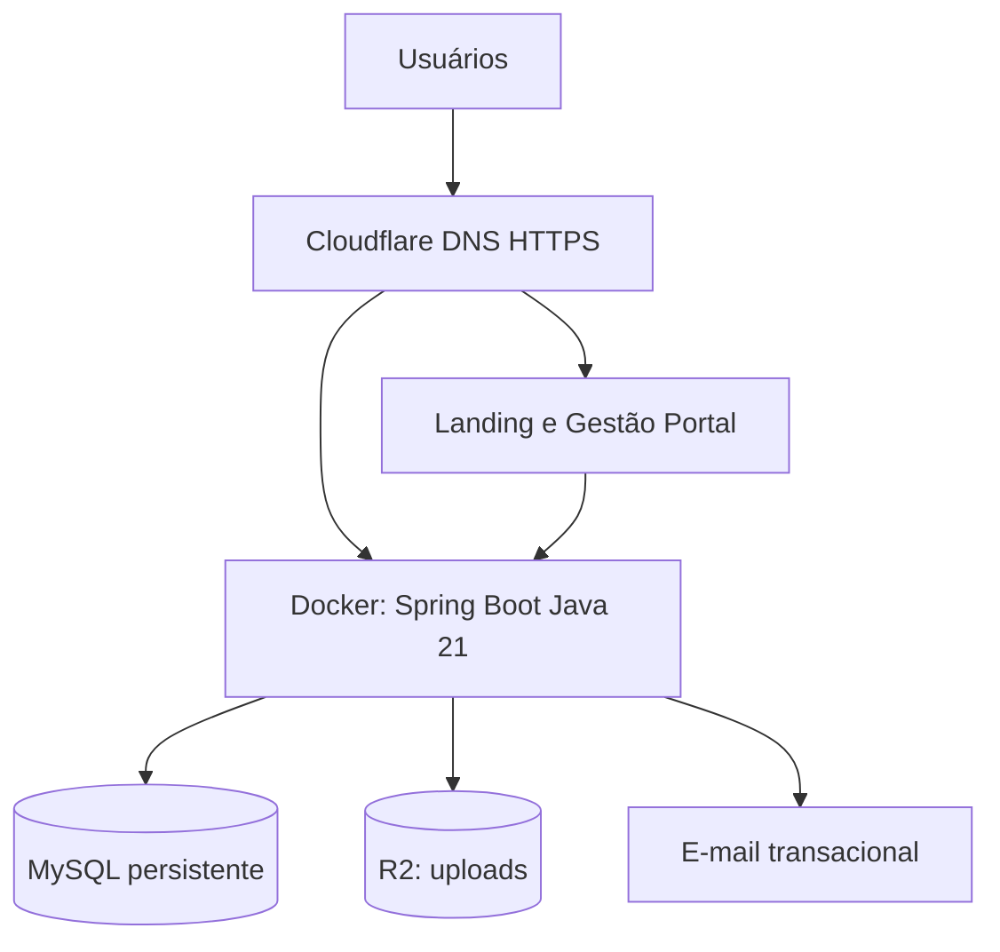
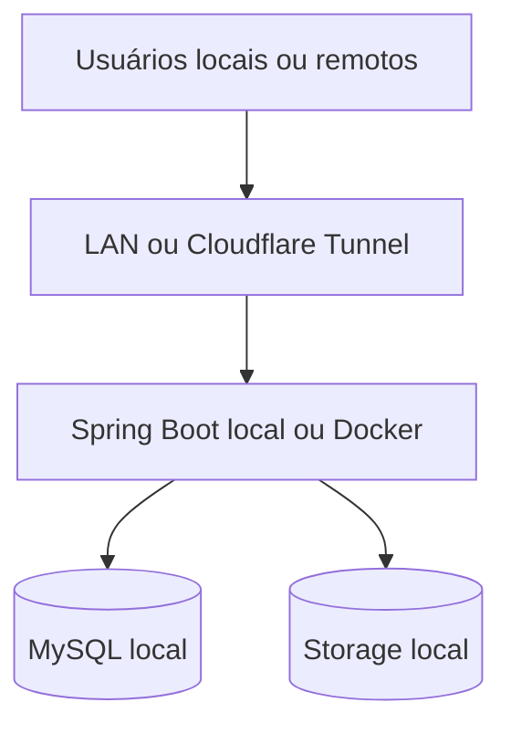

# Arquitetura de deploy — RasComp V1 Beta B

Diagrama lógico de referência (10/10/2026). Não representa infraestrutura já provisionada.

Docker encapsula a API Java. Cloudflare fornece acesso e roteamento; o Docker poderá ser executado em hospedagem compatível escolhida após avaliação. MySQL exige banco persistente separado por ambiente, backup e restore. R2 guarda comprovantes e mídia. Frontends estáticos não precisam de Docker.

## Sequência MySQL

1. Escolher provedor e região.
2. Provisionar bancos separados para homologação e produção.
3. Configurar usuário restrito, rede e TLS, com segredos externos ao código.
4. Habilitar backups e testar restauração.
5. Executar migrations Flyway primeiro em homologação.
6. Conectar a API Docker e validar persistência, saúde, logs e migração.

## Contingência

Durante contingência, somente um ambiente será fonte de verdade para escrita. A volta à cloud exige restauração e reconciliação controladas.
